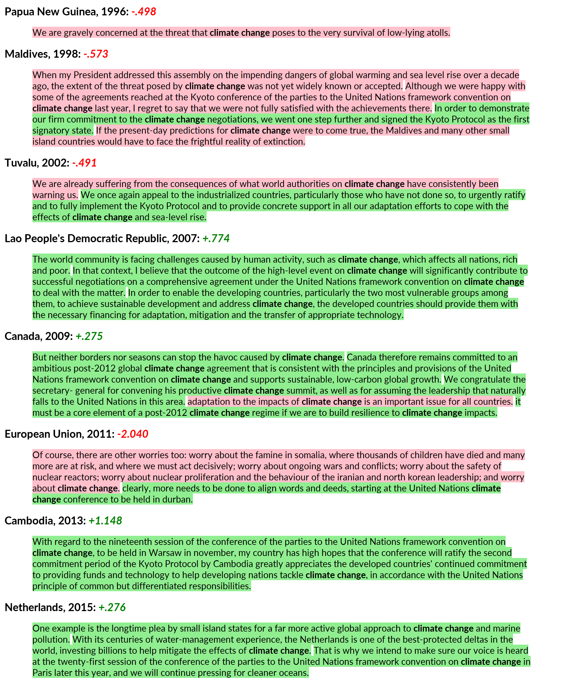

```{r setup, include=FALSE}
knitr::opts_chunk$set(echo = TRUE)
```

```{r load_pacakges, include=FALSE}
# Data Analysis
library(magrittr)    # pipes!
library(readr)       # import data
library(tidyr)       # tidy data
library(dplyr)       # wrangle data
library(stringr)     # handle strings
library(stringi)     # to encode characters
library(forcats)     # handle factors
library(tidytext)    # tidy text mining
library(sentimentr)  # sentiment analysis

# Data Visualization
library(kableExtra)   # render pretty tables
library(formattable)  # format tables
library(ggplot2)      # plot data
library(ggbeeswarm)   # plot scattered distributions
library(ggpage)       # render text pages
library(ggrepel)      # place text labels
library(patchwork)    # arrange plots in a grid
library(leaflet)      # plot maps
library(showtext)     # use custom fonts
library(rnaturalearth)      # import country data
library(rnaturalearthdata)  # import country map geometries
library(CoordinateCleaner)  # import country centroids
```

```{r un_theme, message=FALSE, include=FALSE}
# Create custom colour palette
custom_palette <- c(
  # UN colours
  "blue" = "#3F90DF", "gold" = "#DEA737", 
  # some shades of grey 
  "lightgrey" = "#f5f5f2", "darkgrey" = "#484848"
)

# Function to retrieve colours by name
un_palette <- function(colour){
  unname(custom_palette[names(custom_palette) %in% colour])
}

# Define and set custom ggplot theme 
plot_bkgd <- "#f2f2ef"  # plot background colour
plot_grid <- "#D0CEC5"  # plot girdlines colour

# font_add_google(name = "Lato", family = "Lato")
# showtext_auto()

un_theme <- theme(text = element_text(family = "Lato", color = "#22211d"),
                  rect = element_rect(fill = plot_bkgd),
                  plot.background = element_rect(fill = plot_bkgd, color = NA),
                  panel.background = element_rect(fill = plot_bkgd, color = NA),
                  panel.border = element_blank(),
                  panel.grid = element_line(colour = plot_grid),
                  legend.background = element_rect(fill = plot_bkgd, color = NA),
                  legend.key = element_rect(fill = plot_bkgd))

theme_set(theme_light(base_size = 22) + un_theme)
```

# Context & Inspiration
The United Nations General Assembly (UNGA) is the main deliberative, policy-making and representative body of the UN, being the only principal organ in which all member states have equal representation, consecrated in one vote per country^[the General Assembly’s composition, functions, powers, voting, and procedures are inscribed in Chapter IV of the United Nations Charter, available on this link: http://www.un.org/en/sections/un-charter/chapter-iv/index.html]. 

Every year since its first session, held in 1946 with only 51 nations in attendance, representatives of UN member states gather at the annual sessions of the General Assembly. The centerpiece of the UNGA is the General Debate, a forum in which government officials and senior diplomats address the assembly in the form of a speech, delivering statements that reflect their country's perspective on pressing issues in foreign policy.  

Given the truly global nature of the UNGA, which congregates 193 countries and 2 permanent observer states^[full list of countries and observer states available on this link: http://www.un.org/en/member-states/index.html, including date of admission], the General Debate provides great insight into the affairs that shape the contemporary diplomatic context, covering subjects that encompass poverty and economic growth, peace and security, Human Rights’ violations and threats to sustainable development. On this matter, given its sense of urgency due to the potential impact on Earth's ecosystems, human health and civilization itself, climate change overshadows all other topics.

While climate change is not new to the planet we inhabit, as stated in numerous scientific studies on global temperature change over documented climate cycles [@petit1999climate], the level of climate disruption stemming from human influence now threatens to introduce seemingly small but critical deviations from the stable regime that allowed human societies to develop and prosper.

Having established the significance of the statements delivered at the UN General Debate, effectively convening the foreign policy interests and priorities of each intervening country at the world stage, in this blogpost I will conduct an exploratory analysis of the UN General Debate text corpus - focusing on the topic of climate change, with the aim of answering three key questions: 

* **How has the prevalence of the topic of climate change evolved over time?**
* **Do all UN member states award equal importance to climate change?**
* **Which _sentiment_ underlies the debate over the topic of climate change?**

Insights uncovered throughout the analysis will culminate with the assessment of one final landmark inquiry – _to what extent are the nations of the world truly united in the wake of the threat posed by climate change?_

# Content & Methodologies 

The original transcription of the UN General Debate text corpus was collected by Alexander Baturo, Niheer Dasandi, and Slava Mikhaylov, who presented the findings of their work in the paper _"Understanding State Preferences With Text As Data: Introducing the UN General Debate Corpus"_ [@baturo2017understanding]. 

The actual dataset used in this analysis was retrieved from Kaggle^[https://www.kaggle.com/unitednations/un-general-debates], uploaded and curated by Rachael Tatman to further include the complete text corpus of statements from 1970 (Session 25) to 2015 (Session 70). The data is contained in one master table, with the following fields:

* <p style="text-align:left;"> **Session** : : General Assembly session number, from 25 to 70;</p>
* <p style="text-align:left;"> **Year** : : year of the corresponding session, from 1970 to 2015;</p>
* <p style="text-align:left;"> **Country** : : representatives' country code^[ISO 3166 Alpha-3 country code, more information in the following link: https://www.iso.org/iso-3166-country-codes.html];</p>
* <p style="text-align:left;"> **Text** : : complete text of each countries' statement at the UN General Debate, for every year in the dataset;</p>

The analysis was conducted in **R**, following the _tidytext_ principles defined by Julia Silge and David Robinson in the book _"Text Mining with R"_ [@silge2016tidytext]. The R Markdown file containing the fully reproducible source code is hosted on [Github](https://github.com/CitizenDataScientist/CitizenDataScientist.github.io/tree/master/_posts).

# Exploratory Analysis

This section encloses a selection of key summary metrics of the UN General Debate text corpus, allowing the reader to get acquainted with the dataset and establishing context to the analysis.

```{r import_data, message=FALSE, include=FALSE}
# load the dataset into R (.csv is too big to upload to GitHub)
# link: https://www.kaggle.com/unitednations/un-general-debates
debates_raw <- read_csv("data/un-general-debates.csv")

# copy raw data into a working data frame and perform some transformations
debates <- debates_raw %>%
  # rename column
  rename(speech = text) %>% 
  # sort by session, and alphabetically by country
  arrange(session, country) %>% 
  # text pre-preocessing
  # remove speech number 
  mutate(speech = str_remove_all(speech, '^[:digit:]+\\:')) %>% 
  # drop newline and tab characters 
  mutate(speech = str_replace_all(speech, '\\n|\\t', " ")) %>%  
  # remove paragraph number
  mutate(speech = str_replace_all(speech, '(\\.)?[:digit:]+\\.', "")) %>%  
  # index all speeches
  mutate(speech_id = row_number()) %>% 
  # fix Serbia (post 2006)
  mutate(country = ifelse(country == "YUG" & year >= 2006, "SRB", country))
```

One of the first questions that naturally arises when exploring the data at hand is _how rich is the text corpus?_ From the 25th to the 70th session a total of **7507 statements** were delivered, by a total of **199 distinct countries, observer states and supranational bodies**. Since the first session included in the dataset took place over 45 years ago, how has the number of speeches per year changed or time?

```{r speeches_year, echo=FALSE, fig.height=8, fig.width=16, dev='svg', layout="l-page"}
debates %>% 
  group_by(year) %>% 
  # count the number of countries per year
  summarise(speeches = n()) %>% 
  # define years to highlight: first year, highest speech count, last year 
  mutate(highlight_year = ifelse(year %in% c(min(year), year[which.max(speeches)], max(year)), "highlight", "regular")) %>% 
  
  # feed the data to ggplot
  ggplot(aes(x = year, y = speeches)) + 
  
  # lollipop chart elements
  geom_segment(data = . %>% filter(year %in% seq(min(debates$year), max(debates$year), 5)),
               aes(x = year, xend = year, y = 0, yend = speeches, colour = highlight_year),
               size = 0.4, linetype = "longdash",  show.legend = FALSE) +
  
  geom_point(aes(colour = highlight_year), size = 3.2, show.legend = FALSE) + 
  
  # text annoations
  geom_text(data = . %>% filter(highlight_year == "highlight"),
            aes(x = year, y = speeches, label = speeches), 
            size = 5.5, vjust = -1.2, fontface = "bold", colour = un_palette("darkgrey")) + 
  
  # configure colours 
  scale_colour_manual(values = c("highlight" = un_palette("blue"),
                                 "regular" = un_palette("darkgrey"))) +
  
  # configure axis
  scale_x_continuous(breaks = seq(min(debates$year), max(debates$year), 5)) +
  scale_y_continuous(limits = c(0, 210), expand = c(0, 0)) +
  
  # define axis labels 
  labs(x = "", y = "number of speeches",
       title = "Speeches at the UN General Debate", 
       subtitle = "including countries, observer states and supranational bodies") + 
  
  # plot-specific theme 
  theme(panel.grid.major.x = element_blank(),
        panel.grid.minor.x = element_blank(), 
        panel.grid.minor.y = element_blank(), 
        axis.ticks.y = element_blank())
```

Held in 1970, the 25th session of the United Nations General Debate was the stage of **70** speeches, delivered by the heads of state, government officials or diplomatic representatives in attendance. This number has risen over time, surpassing 150 for the first time in 1987. The highest number of recorded interventions was registered in 2012, when the 193 countries and two permanent observer states addressed the assembly - amounting to **195** speeches. **193** speeches were delivered in 2015, the last year in the dataset, a number that coincides with the current total number of UN member states.

The number of words per speech is an auxiliary quantitative metric that conveys how the General Debate sessions have mutated over time. Computing the word count of a given statement is a nimble task in the _tidytext_ framework - one must simply _tokenize_ the text into individual words. The outcome of this procedure is illustrated in the table below, taking the first few words of the Albanian speech delivered in 1970 as an example.

```{r unnest_tokens, include=FALSE}
debates_words <- debates %>%
  unnest_tokens(word, speech, drop = FALSE) %>% 
  # remove tokens with non-ASCII characters
  filter(stri_enc_isascii(word)) %>%
  # remove all commas from the existing tokens
  mutate(word = str_remove_all(word, "\\,")) %>% 
  # remove all remaining tokens with punctuation
  filter(!str_detect(word, "[:punct:]"))
```

```{r glimpse_data, echo=FALSE, layout="l-body-outset"}
debates_words %>%
  # select the first thirteen rows (ie, tokens)
  head(7) %>%
  # re-arrange columns
  select(session, year, country, speech, token = word) %>% 
  # show only the first 86 characters from the "speech" variable
  mutate(speech = str_trunc(speech, 39)) %>%
  # feed the data to kable
  kable() %>% 
  # center the table and reduce the font size
  kable_styling(position = "center", font_size = 9)
```

<aside>
<p style="text-align:right;"> _Tidytext_ data frame</p>
</aside>

The evolution of speech length, measured as the word count of each country's statement, is presented in the graph below in the form of one box plot ^[the lower and upper hinges correspond to the first and third quartiles (the 25th and 75th percentiles). The upper whisker extends from the hinge to the largest value no further than 1.5 * IQR from the hinge (where IQR is the inter-quartile range, or distance between the first and third quartiles). The lower whisker extends from the hinge to the smallest value at most 1.5 * IQR of the hinge. Data beyond the end of the whiskers are called "outlying" points and are plotted individually - from the ggplot2 reference guide: https://ggplot2.tidyverse.org/reference/geom_boxplot.html] per year. A smooth curve was fitted to the distribution, to assist the reader's interpretation of the trend.

```{r length_over_time, echo=FALSE, fig.height=8, fig.width=16, message=FALSE, dev='svg', layout="l-page"}
speech_length <- debates_words %>%
  # group by year and country
  group_by(year, country) %>%
  # count the number of words per speech
  summarise(word_count = n()) %>%
  ungroup()

# define speeches to highlight
length_annotations <- speech_length %>%
  filter(word_count > 10000)

speech_length %>%
  # feed the data to ggplot
  ggplot(aes(x = year, y = word_count)) +
  geom_boxplot(aes(group = year), fill = un_palette("lightgrey")) +
  # add smooth line
  geom_smooth(se = FALSE, size = 2, colour = un_palette("blue")) +
  # add annotations
  geom_text(data = length_annotations, aes(x = year, y = word_count, label = paste0(country, " (", year, ")")),
            fontface = 'bold', hjust = 0, nudge_x = 0.2) +
  # configure scales and set labels
  scale_x_continuous(breaks = seq(min(debates$year), max(debates$year), 5), expand = c(0,0.5)) +
  scale_y_continuous(breaks = seq(0, 12000, 2000), limits = c(0, 12500), expand = c(0, 0), labels = scales::comma_format()) +
  labs(title = "Statements at the UN General Debate have gotten shorter over time", 
       subtitle = "speeches are now more concise and uniform in length", x = "", y = "word count") +
  # plot-specific theme 
  theme(panel.grid.major.x = element_blank(),
        panel.grid.minor.x = element_blank(), 
        panel.grid.minor.y = element_blank(), 
        axis.ticks.y = element_blank())
```

It is noticeable that **speech length has decreased over time**, from a median of approximately 4000 words in the 1970s and early 1980s to roughly 2000 words in recent years. This change was promoted by reform plans to the General Debate code of conduct, that introduced a voluntary guideline of 20 minutes per statement in 1997^[press-release detailing the reform can be found on this link: https://www.un.org/press/en/1997/19970718.GA9285.html], that has since shifted to 15 minutes per intervention. 

Although the time limit aims to keep the debate more concise, it is not always adhered to - take Libyan leader Muammar Gaddafi's 2009 "rambling and unscripted" speech^[as reported by The Guardian: https://www.theguardian.com/world/2009/sep/23/muammar-gaddafi-general-assembly-speech], speaking for an impressive 90 minutes. The longest statement delivered at the UN General Debate during the years comprised in this dataset belongs to Cuba, as in 1979 Fidel Castro proclaimed 11500 words. The record for the longest speech ever delivered at the UN General Debate also belongs to the illustrious Cuban leader, who in 1960 reportedly spoke for over four hours and a half^[as documented on this link: http://ask.un.org/faq/37127, along with other notably long speeches].

Having uncovered Cuba's tendency to impart in long addresses at the UN General Debate, a follow-up inquiry naturally emerges: _which countries consistently deliver the longest, and shortest, speeches?_ The visualization below aims to answer this question, presenting the top and bottom 8 countries ranked by median speech word count.

```{r top_bot_speeches, echo=FALSE, fig.height=8, fig.width=16, dev='svg', layout="l-page"}
speech_median_length <- speech_length %>%
  group_by(country) %>%
  # compute the median word count per country
  mutate(median_words = median(word_count)) %>%
  # arrange is descending order
  arrange(desc(median_words)) %>%
  ungroup()

longest_speeches <- speech_median_length %>%
  select(country, median_words) %>%
  distinct() %>%
  top_n(8, median_words) %>%
  pull(country)

shortest_speeches <- speech_median_length %>%
  select(country, median_words) %>%
  distinct() %>%
  top_n(-8, median_words) %>%
  pull(country)

speech_median_length %>%
  # subset the list of countries to include
  filter(country %in% union(longest_speeches, shortest_speeches)) %>%
  # add ISO country names
  left_join(maps::iso3166 %>%
              select(a3, ISOname) %>%
              add_row(a3 = "CSK", ISOname = "Czechoslovakia") %>% 
              filter(ISOname != "Clipperton Island"), # remove mis-captured country
            by = c("country" = "a3")) %>%
  # add the label to include in the plot
  mutate(speech_class = ifelse(country %in% longest_speeches,
                               'highest median word count',
                               'lowest median word count')) %>%
  # feed data to ggplot
  ggplot(aes(x = fct_reorder(ISOname, median_words), y = word_count, group = country)) +
  geom_point(size = 2, alpha = .7, colour = un_palette("darkgrey")) +
  # add meadian, per country
  stat_summary(fun.y = median, geom = "point", shape = 18, size = 5, color = un_palette("blue")) +
  # facet by top / bottom
  facet_wrap(~ speech_class , ncol = 1, scales = 'free_y') +
  # flip plot coordinates
  coord_flip() +
  # configure scales and set labels
  scale_y_continuous(breaks = seq(0, 12000, 2000), limits = c(0, 12500), expand = c(0, 0), labels = scales::comma_format()) +
  labs(title = 'Top and bottom 8 countries, sorted by median word count', subtitle = 'some countries go on forever, others not so much',
       x = '', y = 'word count') + 
  # plot-specific theme 
  theme(axis.ticks.x = element_blank(), 
        panel.grid.minor.x = element_blank())
```

<aside>
<p style="text-align:right;">each dot represents a speech; median is depicted by the blue diamond</p>
</aside>

Cuba rounds off the top 5 of the most talkative countries, behind the former state of Czechoslovakia. Ireland emerges in first place, with the highest recorded median word count during the period comprised in the dataset. On the other end of the spectrum, the Southeast Asia nation of Brunei - admitted to the UN in 1984 - ranks as the country with the lowest speech median word count, having never delivered an address with more than 2000 words.

Thus far, the focus has been on purely quantitative metrics that translate how the UN General Debate has evolved over time. Extending the scope of the exploratory analysis to the lexicon of the text corpus allows for insights on the actual topics that shaped the General Debate to be uncovered. 

The first step in exploring the lexicon of the dataset is listing the most mentioned words across the considered time period. A routine pre-processing step in text analytics when conducting word frequency count is to remove _stopwords_, i.e. notoriously common words with low significance – such as “the”, “of” and “to”. The graph below shows the top 20 most prominent words found in the General Debate text corpus from 1970 to 2015, having removed _stopwords_ following the tidy approach detailed in [@silge2016tidytext].

```{r remove_stopwords, include=FALSE}
# debates_words_processed <- debates_words %>%
#   # drop the 'speech' column from the working dataset
#   select(-speech) %>%
#   # remove all leading and trailing numbers attached to tokens
#   mutate(word = str_remove(word, regex('^[:digit:]+|[:digit:]+$'))) %>%
#   # remove tokens with 3 or more repeated letters
#   filter(!str_detect(word, "(.)\\1{2,}")) %>%
#   # remove any remaining single letter tokens
#   filter(!str_detect(word, pattern = "\\b(.)\\b")) %>%
#   # keep only tokens that contain letters
#   mutate(word = str_extract(word, "[a-z]+")) %>%
#   # remove empty tokens
#   filter(!word == "") %>%
#   # remove stop words
#   anti_join(stop_words)
# 
# save(debates_words_processed, file = "debates_words_processed.RData")

load("debates_words_processed.RData")
```

```{r top_words, echo=FALSE, fig.height=8, fig.width=16, dev='svg', layout="l-page"}
void_meaning = c("assembly", "country", "countries", "international", "nations", "united", "world")

debates_words_processed %>%
  count(word, sort = TRUE) %>%
  mutate(word = fct_reorder(word, n)) %>% 
  head(20) %>%
  ggplot(aes(x = word, y = n, colour = ifelse(word %in% void_meaning, "inconsequential", "meaningful"))) +
  geom_segment(aes(x = word, xend = word, y = 0, yend = n), size = 1.6, show.legend = FALSE) +
  geom_point(size = 5) +
  geom_text(aes(label = word), size = 5.4, hjust = 0, nudge_y = 1500) + 
  coord_flip() +
  # configure colours
  scale_colour_manual(name = "word significance", values = c("meaningful" = un_palette("blue"),
                                                             "inconsequential" = un_palette("darkgrey"))) +
  
  # configure scales and set labels
  scale_y_continuous(breaks = seq(0, 125000, 25000), limits = c(0, 135000), expand = c(0, 0), labels = scales::comma_format()) +
  labs(title = 'Top 20 most prominent words at the UN General Debate', subtitle = '1970 - 2015, coloured by within-context significance',
       x = '', y = 'word mentions') +
  
  # plot-specific theme
  theme(panel.grid.minor.x = element_blank(),
        panel.grid.major.y = element_blank(),
        panel.grid.minor.y = element_blank(),
        axis.text.y = element_blank(),
        axis.ticks = element_blank(), 
        legend.position = c(0.75, 0.075),
        legend.direction = "horizontal")
```

As expected, the list is dominated by words that are transversal to most speeches, such as “nations”, “united”, “international”, “world” and “countries”. These words, along with “assembly” and "session" (ranked #21) provide little context to the analysis, as they are featured in most opening statements and closing remarks; they are **inconsequential** and should, by extension, be treated as _stopwords_ in this context. Words highlighted as **meaningful**, however, convey the first qualitative insights into the most prominent topics discussed at the UN General Debate. “Peace” emerges ahead of “development”, “security” and “economic”, suggesting that the main purpose of the organization - _to maintain international peace and security_, consecrated in the Article 1^[full charter available on this link: https://www.un.org/en/sections/un-charter/chapter-i/index.html] - is reflected in the content of the debate.

```{r process_bigrams, include=FALSE}
# debates_bigrams <- debates %>%
#   unnest_tokens(bigram, speech, drop = FALSE, token = "ngrams", n = 2)
# 
# debates_bigrams_processed <- debates_bigrams %>%
#   # drop the 'speech' column from the working dataset
#   select(-speech) %>%
#   # remove bigrams with non-ASCII characters
#   filter(stri_enc_isascii(bigram)) %>% 
#   # remove all commas from the existing bigrams
#   mutate(bigram = str_remove_all(bigram, "\\,")) %>% 
#   # remove tokens with 3 or more repeated letters
#   filter(!str_detect(bigram, "(.)\\1{2,}")) %>%
#   # remove empty tokens
#   filter(!bigram == "") %>%
#   # remove all remaining tokens with numbers from the dataset
#   filter(!str_detect(bigram, '[:digit:]')) %>%
#   # remove tokens with special characters
#   filter(!str_detect(bigram, "[:punct:]")) %>% 
# 
#   # split bigrams into two words
#   separate(bigram, into = c("word_1", "word_2"), remove = FALSE, sep = " ") %>%
#   # remove bigrams...
#   anti_join(stop_words, by = c("word_1" = "word")) %>% # ... with leading stop-word
#   anti_join(stop_words, by = c("word_2" = "word")) %>% # ... with trailing stop-word
#   # re-unite bigrams
#   unite(c("word_1", "word_2"), col = bigram, sep = " ")
# 
# save(debates_bigrams_processed, file = "debates_bigrams_processed.RData")

load("debates_bigrams_processed.RData")
```

In the quest to unravel the topics that dominated the UN General Debate sessions through the years it is preferable to focus on decades rather than performing the word count exercise with increased granularity at year level. The decision to aggregate the data by ten-year periods (five, in the case of the 2010s) allows the reader to ascertain which affairs warranted prolonged discussion at the General Assembly and thus truly shaped foreign policy discussion at a time scale relatable to man, the _decade_. However, single word frequency count at decade level is likely to yield similar results to those observed for the complete time period enclosed in the dataset. In the field of text mining and analytics it is common practice to extend the _tokenization_ process beyond single words, to entities known as _n-grams_; in this case, greater insights into the actual topics and events can be gathered by exploring the occurrence of prominent word pairs, or _bigrams_. Similarly to single-word tokens, bigrams containing stopwords (including those labelled as “inconsequential”) were excluded from the dataset. 

The plot below shows the top six bigrams per decade, from the 1970s to the early 2010s.

```{r top_bigrams, echo=FALSE, fig.height=8, fig.width=16, dev='svg', layout="l-page"}
# define set of words "void of meaning"
void_meaning = c("assembly", "country", "countries", "international", "people", "nations", "session", "united", "world")

bigrams_decade <- debates_bigrams_processed %>%
  # remove words "void of meaning"
  filter(!str_detect(bigram, paste(void_meaning, collapse = "|"))) %>%
  # extract the decade from the year variable
  mutate(decade = year - year %% 10) %>%
  # count words by decade, sorting the results
  group_by(decade) %>%
  count(bigram) %>%
  arrange(decade, desc(n))

bigrams_decade %>%
  # focus on the top 6 bigrams per decade
  top_n(6, n) %>%
  # get the bigram's rank, from the sorted row numbers in each group
  mutate(decade_rank = row_number()) %>%
  # 
  mutate(relative_n = 1/decade_rank) %>%
  ungroup() %>%
  # feed data to ggplot & conditional highlight "climate change"
  ggplot(aes(x = paste0(decade, "s"), y = decade_rank,  group = bigram, label = str_to_title(bigram),
             colour = ifelse(bigram == "climate change", "hightlight", "normal"))) +
  geom_line(linetype = "longdash", size = 0.65) +
  geom_point(aes(size = relative_n )) +
  
  # add text labels, with different placement
  geom_text(data = . %>% group_by (bigram) %>% filter(decade == max(decade) & decade < 2010),
            fontface = "bold", size = 4.8, vjust = 0.8, hjust = -0.06) +
  
  geom_text(data = . %>% group_by (bigram) %>% filter(decade == 2010),
            fontface = "bold", size = 4.8, vjust = -0.8, hjust = 1.02) +
  
  # configure scales and set labels
  scale_x_discrete(expand = c(0, 0.075)) +
  scale_y_reverse() +
  scale_size_continuous(range = c(2, 7)) + 
  scale_colour_manual(values = c("hightlight" = un_palette("blue"), "normal" = un_palette("darkgrey"))) +
  guides(colour = FALSE, size = FALSE) +
  labs(title = 'Climate Change is heating up UN General Debate', 
       subtitle = 'focus shifts to sustainable development goals, with Human Rights being ever-present',
       x = "", y = "bigram preponderance") +
  # plot-specific theme
  theme(panel.grid.minor.x = element_blank(),
        panel.grid.major.y = element_blank(),
        panel.grid.minor.y = element_blank(), 
        axis.text.y = element_blank(),
        axis.ticks = element_blank())
```

<aside>
<p style="text-align:right;">2010s: 2010 to 2015</p>
</aside>

Now this is a rather interesting visualization. 

Conflicts in the **Middle East** were at the forefront of the General Debate in the **1970s**. This was a period of notable turmoil and outright war in the region, during which Israeli armies fought opposing forces from Palestine, Egypt and other Arab countries for control over disputed territories. Political instability and armed conflicts prevailed throughout the 1980s, 90s and 2000s, with the text corpus of the General Debate 
echoing the concerns expressed at the General Assembly. The Middle East remains a tumultuous region, but the bigram dropped out of the top six word pairs in the early 2010s.

The **1980s** were dominated by the talks condemning the **South African Apartheid system**, known for racial segregation, discrimination and violence towards the native African population. This topic had been heavily debated in the previous decade, but its relevance at the world stage diminished in the 1990s, as Apartheid legislation was repealed in June 1991 and open democratic elections held in April 1994, famously own by Nelson Mandela. 

The transition period between the 1980s and the **1990s** was rich in talks concerning the **Soviet Union** and the **Cold War**, with the importance of **Peace Keeping** being reinstated several times following the fall of the Berlin Wall in November 1991. The two most prominent bigrams in this decade were **Human Rights** and the UN’s **Security Council**, two topics that have commanded the General Debate interchangeably over the years.

As the world embarked on the new millennium, special attention was awarded to the importance of establishing and binding member states to **Sustainable Development Goals** (SDGs), striving to improve health and education, reduce inequality, and spur economic growth while preserving natural resources. This endeavour, already prominent in the **2000s**, culminated in 2015 with the adoption of the _2030 Agenda for Sustainable Development_ - a set of 17 SDGs to be achieved by 2030^[the complete list of SDGs can be found on this link: https://www.un.org/sustainabledevelopment/sustainable-development-goals/], providing a shared blueprint to which all member states should adhere to in order to address global challenges in a joint effort.

**Climate Change** emerged as a hot topic in the **2000s**, ranking as the third most prominent bigram of this time period. This trend propelled into the **2010s**, with climate change emerging as the second most frequent bigram during the first five years of the decade, on a list topped by ever-present topic of **Human Rights**.

Yearly mentions of climate change at the UN General Debate, along with a selection of climate-related bigrams, are presented in greater detail in the plot below.

```{r climate_change_mentions, echo=FALSE, fig.height=10, fig.width=16, dev='svg', layout="l-page"}
# Compute the number of speeches per year
speeches_year <- debates %>%
  group_by(year) %>%
  summarise(n_speeches = n())

climate_bigrams <- debates_bigrams_processed %>%
  # search for Climate Change & some related bigrams
  mutate(climate_tag = case_when(
    str_detect(bigram, "^climate change$") ~ "Climate Change",
    str_detect(bigram, "global warming") ~ "Global Warming",
    str_detect(bigram, "fossil fuel(s)?") ~ "Fossil Fuel(s)",
    str_detect(bigram, "greenhouse (effect|gas(es)?)") ~ "Greenhouse Effect / Gas(es)",
    str_detect(bigram, "ozone (hole|layer)") ~ "Ozone Hole / Layer",
    str_detect(bigram, "kyoto protocol") ~ "Kyoto Protocol",
    str_detect(bigram, "paris (climate|agreement)") ~ "Paris Climate / Agreement")
  ) %>% 
  
  # remove untagged bigrams
  filter(!is.na(climate_tag)) %>%
  
  # group by year & tag, and count mentions
  group_by(year, climate_tag) %>%
  summarise(count_mentions = n()) %>%
  
  # left-join the number of speeches per year
  left_join(speeches_year, by = "year") %>%
  # compute the mean number of tagged bigram mentions per speech, in each year
  mutate(mean_mentions = count_mentions/n_speeches) %>% 
  ungroup()

# subplot 1 - mentions of Climate Change over time
climate_mentions <- climate_bigrams %>%
  # focus only on Climate Change
  filter(climate_tag == "Climate Change") %>% 
  ggplot(aes(x = year, y = count_mentions)) +
  geom_line(size = 1, colour = un_palette("blue"), show.legend = FALSE) +
  geom_point(size = 2.8, colour = un_palette("blue"), show.legend = FALSE) +
  
  geom_text(data = . %>% top_n(1, count_mentions),
            aes(label = count_mentions, x = year, y = count_mentions),
            colour = un_palette("darkgrey"), vjust = - 0.75, size = 5.5) + 
  
  # configure scales and set labels
  scale_x_continuous(limits = c(min(debates$year), max(debates$year)),
                     breaks = seq(min(debates$year), max(debates$year), 5)) +
  scale_y_continuous(limits = c(-10, max(climate_bigrams$count_mentions) + 100), 
                     expand = c(0, 0.1)) + 
  labs(title = "Climate-related bigrams at the UN General Debate, 1970 - 2015", 
       subtitle = "mentions of Climate Change peaked in 2009", 
       x = "", y = "mentions per year") 

# subplot 2 - mentions of climate-related bigrams over time
related_mentions <- climate_bigrams %>%
  # focus only on all but Climate Change
  filter(climate_tag != "Climate Change") %>% 
  ggplot(aes(x = year, y = count_mentions)) +
  geom_line(size = 1, colour = un_palette("darkgrey"), show.legend = FALSE) +
  geom_point(size = 2.8, colour = un_palette("darkgrey"), show.legend = FALSE) +
  
  geom_text(data = . %>% group_by(climate_tag) %>% top_n(1, count_mentions),
            aes(label = count_mentions, x = year, y = count_mentions),
            colour = un_palette("darkgrey"), vjust = - 0.75, size = 5.5) +
  
  # add annotations
  # Paris Agreement
  geom_label(data = . %>% filter(climate_tag == "Paris Climate / Agreement"), 
             aes(x = 1979, y = 80, label = "not the Paris Agreement\nwe are looking for"), 
             hjust = 0, vjust = 0.5, lineheight = 0.8, label.size = NA, size = 6,
             colour = un_palette("darkgrey"), fill = plot_bkgd) + 
  geom_curve(data = . %>% filter(climate_tag == "Paris Climate / Agreement"), 
             aes(x = 1976, y = 75, xend = 1979, yend = 80), 
             colour = un_palette("darkgrey"), 
             curvature = -0.2,
             size = 0.5) +
  
  facet_wrap(. ~ climate_tag) +
  
  # configure scales and set labels
  scale_x_continuous(limits = c(min(debates$year), max(debates$year)),
                     breaks = seq(min(debates$year), max(debates$year), 10)) +
  scale_y_continuous(limits = c(-1, 110), expand = c(0, 0.1)) +
  labs(x = "", y = "") 

# arrange plots in a grid and apply overall theme
climate_mentions + 
  related_mentions +  
  plot_layout(ncol = 1, heights = c(2, 3)) & 
  theme(axis.ticks.y  = element_blank(),
        panel.grid.major.x = element_blank(),
        panel.grid.minor = element_blank()
  )
```

The first mention of climate change was professed by the Canadian Prime-Minister in 1988; at the time, Mr. Mulroney stated:

>	[...] The signature a year ago in Montreal of the Protocol on the protection of the ozone layer is a landmark example of what nations working together can accomplish. I urge all States which have not yet done so to sign and ratify the Protocol without delay. The increasingly urgent question of global warming and **climate change** received serious attention at the International Conference on the Changing Atmosphere in Toronto last June. [...]

Despite the gradual increase over the subsequent sessions, the number of mentions per year would remain well below 100 until 2007. A great surge was observed at the 62nd session of the General Assembly, driven by the  _theme_ of the debate, **Responding to climate change**^[full list of debate themes can be found on this link: https://www.un.org/en/ga/sessions/regular.shtml]. In his opening speech, the President of the UN General Assembly stressed that _“climate change and its dramatic effects are increasingly visible and increasingly violent. The irony is that those least responsible for it will suffer most”_. The extent to which this statement is true will become evident over the course of this analysis.

Mentions of climate change would peak two years later, with the topic being referenced **773** times in 2009. Considering that 189 speeches were delivered at the 64^th^ session of the General Debate, this amounts to – on average – four mentions per speech. The number of mentions dropped for three years following the maximum registered in the period considered in this dataset, but the topic remains at the forefront of the discussion and seems to be picking up momentum once again. 

The inclusion of six climate-related bigrams in the previous graph further illustrates the relative importance awarded to climate change. While mentions of **global warming** and **greenhouse effect / gas(es)** seem to be correlated with climate change, both bigrams lag behind by one order of magnitude. The topic of **fossil fuel(s)** seems to receive low significance compared to what would be expected in the wake of the discussion surrounding clean and renewable energy sources. The **Paris Climate / Agreement** would only be ratified and singed by member states in 2016, hence the small number of references to the consensus-building document registered in years leading up to 2015. The **Kyoto Protocol**, its predecessor, was only mentioned – on average – in one third of all speeches delivered in 2007. 

Lastly, we turn to the **Ozone hole / layer** topic. The issue that dominated climate discussion in the nineties and is now on track for a full recovery by 2060^[https://news.un.org/en/story/2018/11/1024842] provides a beacon of  hope for the challenges posed by climate change – the international community once rallied to face a similar threat to climate change, with tangible consequences that were broadly divulged in the media. We must do the same again.

Having plotted the mentions of climate change over time and interpreted the relative importance awarded to this topic in comparison to related climate bigrams, the scope of the analysis can be narrowed in the interest of the research question that propelled this publication – to which extent are the nations of the world truly united in the face of the threat posed by climate change?

A tentative answer stemming from the scrutiny of the UN General Debate text corpus to this open-ended inquiry should consider the total number of mentions of climate change professed by each country over time, a metric presented in the plot below. It is important to underline that, while the number of mentions of climate change at the UN General Debate does not relay the full picture of a given country’s commitment to and involvement in tackling this challenge, it can certainly help to gauge the degree to which a nation is concerned about the topic.   

```{r climate_change_dots, echo=FALSE, fig.height=8, fig.width=16, warning=FALSE, dev='svg', layout="l-page"}
climate_change_mentions <- debates_bigrams_processed %>%
  # keep only mentions of "climate change"
  filter(str_detect(bigram, "^climate change$")) %>% 
  # count mentions by country
  group_by(country) %>%
  summarise(mentions = n()) %>% 
  # preserve countries with zero mentions
  right_join(debates_bigrams_processed %>% select(country) %>% distinct(), by = "country") %>%
  mutate(mentions = replace_na(mentions, 0)) # replace NA's with zeros

# visualize the data in a beeswarm plot 
climate_change_mentions %>% 
  arrange(desc(mentions)) %>% 
  mutate(label_side = rep(c("down", "up"), len = nrow(.))) %>%
  mutate(bin_mentions = cut(mentions,
                            breaks = c(-1, 5, 25, 50, 75, 100, Inf),
                            labels = c("0 - 5", "6 - 25", "26 - 50", "51 - 75", "76 - 100", "+ 100"))
  ) %>%
  left_join(maps::iso3166 %>% select(a3, ISOname) %>% distinct(), by = c("country" = "a3")) %>% 
  ggplot(aes(x = 1, y = mentions)) +
  
  geom_text_repel(data = . %>% filter(mentions >= 75 & label_side == "up" & country != "FSM"), aes(label = str_replace(ISOname, " ", "\n")), 
                  size = 5, hjust = 1.15, nudge_x = 0.32, direction = "x") + 
  
  geom_text_repel(data = . %>% filter(mentions >= 75 & label_side == "down" & country != "FSM"), aes(label = str_replace(ISOname, " ", "\n")), 
                  size = 5, hjust = 1.15, nudge_x = -0.32, direction = "x") +
  
  geom_text_repel(data = . %>% filter(country == "FSM"), aes(label = ISOname), 
                  size = 5, fontface = "bold", hjust = 1, nudge_x = -0.4) +
  
  geom_quasirandom(aes(size = bin_mentions, fill = bin_mentions), width = 0.4, shape = 21, colour = un_palette("darkgrey"), stroke = 1.1) + 
  
  coord_flip() +
  # configure scales and set labels
  scale_x_continuous() + 
  scale_y_continuous(breaks = seq(0, 200, 25)) + 
  scale_size_discrete(range = c(2, 8)) + 
  scale_fill_brewer(palette = "RdBu", direction = -1) +  
  labs(title = 'Mentions of Climate Change at the UN General Debate, 1970 - 2015', 
       subtitle = 'South-East Asia Island Nations fear the changing tide the most',
       x = "", y = "", fill = "total mentions", size = "total mentions") +
  
  # plot-specific theme
  theme(panel.grid.minor.x = element_blank(),
        panel.grid.major.y = element_blank(),
        panel.grid.minor.y = element_blank(), 
        axis.text.y = element_blank(),
        axis.ticks = element_blank(),
        legend.position = "bottom") + 
  guides(size = guide_legend(nrow = 1))
```

Each dot represents one country, sorted along the horizontal axis by total number of mentions, with a random jitter effect  to  avoid overlaps. Points are coloured in one of six colours, ranging from dark-blue (0 to 5 mentions) to dark-red (more than 100 mentions); this colour palette allows the reader to better differentiate between clusters of countries that emerge as a consequence of the varying range of mentions of climate change, with the majority having mentioned climate change 6 to 25 times and some nations being seemingly _unphased_ by the problem, whilst some are _deeply concerned_. The latter group is composed by four **South-East Asia island nations**, with the **Federal States of Micronesia** being the country with the most mentions. This cluster is followed by the countries coloured in dark-orange, a list that – with the exception of Cambodia – is also exclusively made up of island nations.  

The same data is presented below in form of a map, with countries being coloured according to the same colour palette. The map is interactive, supporting pan and zoom while showing the number of mentions of climate change as the user hovers over each country.

```{r climate_change_map, echo=FALSE, fig.height=8, fig.width=16, warning=FALSE, dev='svg', layout="l-page"}
# get world map polygons
world_raw <- ne_countries(scale = 'medium', returnclass = 'sp')

# merge with Climate Change mentions
map_climate_change_mentions <- sp::merge(world_raw, climate_change_mentions, by.x = "adm0_a3", by.y = "country")

# get centroids for subset of "critical countries"
country_centroid <- countryref %>% select(iso3, centroid.lon, centroid.lat) %>% 
  group_by(iso3) %>% 
  slice(1) %>%
  ungroup() %>% 
  left_join(climate_change_mentions %>% filter(), by = c("iso3" = "country")) %>% 
  filter(mentions >= 75) %>% 
  select(-mentions)

# merge with map polygons and remove Antarctica
map_climate_change_mentions <- sp::merge(map_climate_change_mentions, country_centroid, by.x = "iso_a3", by.y = "iso3")
map_climate_change_mentions<- subset(map_climate_change_mentions, adm0_a3 != "ATA")

# build plot dependencies
# discrete colour palette
bins <- c(0, 5, 25, 50, 75, 100, Inf)
pal <- colorBin("RdBu", domain = map_climate_change_mentions$mentions, bins = bins, reverse = TRUE)

# marker icons
icons <- awesomeIcons(
  icon = 'ios-alert',
  iconColor = 'white',
  library = 'ion',
  markerColor = "red"
)

# tooltip labels
labels <- sprintf(
  "<strong>%s</strong><br/>%g mentions",
  map_climate_change_mentions@data$admin, map_climate_change_mentions@data$mentions) %>% 
  lapply(htmltools::HTML)

# feed data to leaflet
leaflet(map_climate_change_mentions, 
        options = leafletOptions(minZoom = 2, maxZoom = 10, worldCopyJump = TRUE)) %>% 
  addPolygons(color = un_palette("darkgrey"), weight = 1, smoothFactor = 0.5, 
              fillColor = ~pal(mentions), 
              opacity = 0.7, fillOpacity = 0.7,
              highlightOptions = highlightOptions(color = "#666", weight = 4,
                                                  bringToFront = TRUE),
              label = labels) %>%
  # set initial view
  setView(lng = 90, lat = -4, zoom = 3) %>% 
  # add markers
  addAwesomeMarkers(lng = ~centroid.lon, lat = ~centroid.lat, icon = icons,
                    label = ~as.character(paste0(admin, " (", mentions ," mentions)"))) %>% 
  # add legend
  addLegend(pal = pal, values = ~mentions, opacity = 0.7, title = NULL,
            position = "topright")
```

Visualizing the data imprinted on the familiar planisphere further helps to convey the message of how critical the consequences of climate change will be for islands nations. These territories, already difficult to pinpoint on the map without the assistance of the red pins, stand to be partly or fully submerged by rising sea levels. The number of environmental refugees will undoubtedly increase as the water claims villages and cities located near the shore, a phenomenon that will extend to coast-lines across the globe if the due diligent targets for reducing emissions and behavioral changes are not swiftly met.

The visualizations presented up to this point have contributed to establish the prevalence of the topic of climate at the General Debate - per country and over time - evidencing that UN member states award varying degrees of importance to this subject. As mentioned, this observation is sustained by the hypothesis that the total number of mentions is positively correlated with the level of urgency each country expresses towards the problem. To complete the assessment of the proposed triad of research questions the blogpost culminates with an analysis of how the _sentiment_ towards the topic of climate change at the UN General Debate has shifted over time.

# Sentiment Analysis

Computational sentiment analysis is based on the premise that the **overall emotive content** of a text snippet (be it a sentence, speech, collection of documents or even a book) can be approximated by the **cumulative contribution** of its individual words. 

**Dictionary-based methods**, the simplest implementations of sentiment analysis algorithms, resort to previously defined **sentiment lexicons**, compiled by linguist scholars and researchers who have assigned scores of _positive_ or _negative_ sentiment **polarity** – along with overarching emotions like _joy_ _anger_, _sadness_ or _trust_ – to both general-purpose and domain-specific words in many languages. In the context of text analytics and natural language understanding, these _dictionaries_ can be employed to infer whether a text excerpt carries either a _positive_ or _negative_ feeling, or is perhaps characterized by some other nuanced emotion. An overview of the most common sentiment lexicons and their applications can be found in [chapter two](https://www.tidytextmining.com/sentiment.html) of the work by Silge and Robinson [@silge2016tidytext]. In their book the authors note that general-purpose lexicons are recurrently used as lookup _unigrams_ (single word tokens) in tabular, _inner-join_ methodologies, that do not account for the effect of _**text qualifiers**_ (adverbs like "_very_", negators like "_not_", and so forth) on the contribution of polarized words. 

Cognizant of the relevance of said modifiers and the consequences that their omission might entail on the output of the analysis, Tyler Rinker developed the [**`SentimenR`** package](https://cran.r-project.org/web/packages/sentimentr/index.html) to compute text sentiment at sentence level in timely fashion, while incorporating the effect of  qualifiers - or **valence shifters**, as they are referred to by the author^[the author provides substantial evidence into the benefits of incorporating valence shifters, along with a comprehensive description of the algorithm’s inner workings on the package’s GitHub page – available on this link: https://github.com/trinker/sentimentr]. The output produced by **`SetitmentR`** is an _unbounded sentiment polarity score_ at sentence level, meaning that sentences are attributed a score ranging from negative to positive values, whose magnitude is proportional to how _polarizing_ the negative or positive sentiment conveyed by the sentence actually is. Sentences scored as 0 are considered to be _neutral_. 

Concerning the task of identifying the segments of speech to be considered in the sentiment analysis, the decision was made to restrict the scope to include only sentences containing mentions of climate change. This process, which effectively creates _window of interest_ composed by sentences explicitly pertaining to climate change, is illustrated below^[rendered using the `ggpage` package - available on this link: https://emilhvitfeldt.github.io/ggpage/].

```{r climate_window_page, echo=FALSE, fig.height=8, fig.width=16, dev='svg', layout="l-page"}
# Window Function 
window_sentences <- function(lookup_expression){
  debates %>%
    # subset look-up period to year >= first mention of climate change
    filter(year >= climate_bigrams %>% filter(climate_tag == "Climate Change") %>% select(year) %>% min()) %>% 
    # keep only speeches macthing the look-up expression
    filter(str_detect(speech, regex(lookup_expression, ignore_case = TRUE))) %>%
    # tokenize matching speeches by sentence
    unnest_tokens(input = speech, output = sentence, token = "sentences") %>% 
    # keep the sentences that contain mentions of the look-up expression, along with the preceeding and the following sentences
    mutate(hit = ifelse(str_detect(sentence, regex(lookup_expression, ignore_case = TRUE)), "match", "no match")) %>%
    mutate(hit = ifelse(lead(hit, default = "no match") == "match" & hit != "match", "preceding", hit)) %>%
    mutate(hit = ifelse(lag(hit, default = "no match") == "match" & hit != "match", "following", hit)) %>%
    filter(hit != "no match")
}

climate_window <- window_sentences("\\bclimate change\\b")

climate_window_highlight <- climate_window %>%
  # focus on one speech with two mentions of climate change
  group_by(speech_id) %>% 
  add_count(hit) %>%
  filter(hit == "match" & n == 2) %>% 
  ungroup() %>% 
  # pick the first speech that meets the criteria
  top_n(-1, speech_id) %>%
  # join the complete speech text
  left_join(debates %>% select(speech_id, speech), by = "speech_id") %>% 
  select(speech) %>% 
  distinct() %>% 
  # hack to preserve sentences...
  mutate(speech = str_replace_all(speech, "\\.(?=[[:space:]][A-Z])", " endofsentence")) %>% 
  # build the ggpage object
  rename(text = speech) %>% 
  ggpage_build(lpp = 20, nrow = 3, wtl = TRUE) %>%
  # sort by page and line number
  arrange(page, line) %>% 
  # ...resume the hack
  mutate(sentence = ifelse(word == "endofsentence", row_number(), NA)) %>% 
  fill(sentence, .direction = c("up"))  %>%
  # add a number to the last sentence, not "filled-in"
  mutate(sentence = replace_na(sentence, nrow(.))) %>% 
  # replace auxiliary word by a period
  mutate(word = str_replace_all(word, "endofsentence", "\\.")) %>% 
  # rank hits to get ordered sentence numbers
  mutate(sentence = dense_rank(sentence)) %>%
  # index words by row number
  mutate(index_word = row_number()) %>% 
  # locate metions of climate change, to highlight
  mutate(cc_mention = ifelse(str_detect(word, "climate") & str_detect(lead(word), "change"), "highlight", "neutral")) %>% 
  mutate(cc_mention = ifelse(lag(cc_mention, default = "neutral") == "highlight", "highlight", cc_mention))

# Compute sentence index for the sentiment windows
climate_window_highlight_idx <- climate_window_highlight %>% filter(cc_mention == "highlight") %>% pull(sentence) %>% unique()
climate_window_highlight_idx <- climate_window_highlight_idx %>% purrr::map(~seq(.x, .x)) %>% unlist()

# feed the data to ggpage
climate_window_highlight %>% 
  mutate(cc_mention = ifelse(sentence %in% climate_window_highlight_idx & cc_mention != "highlight", "sentiment_window", cc_mention)) %>% 
  ggpage_plot(aes(fill = cc_mention)) +
  scale_fill_manual(limits = c("highlight", "sentiment_window", "neutral"),
                    values = c("highlight" = un_palette("gold"),"sentiment_window" = un_palette("blue"), "neutral" = "grey70"),
                    labels = c("highlight" = "'climate change'", "sentiment_window" = "sentiment window", "neutral" = "other words"),
                    name = "window of interest") + 
  # plot-specific theme
  theme(legend.position = c(0.89, 0.14),
        legend.title = element_text(size = 16), 
        legend.text = element_text(size = 14))
```

<aside>
<p style="text-align:right;">Dutch speech delivered in 1989, the first to mention _climate change_ twice</p>
</aside>

```{r sentimentr_generate_highlight, include=FALSE}
climate_window_new <- climate_window %>%
  filter(hit %in% c("match")) %>% 
  # add sentence-level polarity score to each speech 
  left_join(climate_window %>%
              filter(hit %in% c("match")) %>% 
              mutate(sentences_split = get_sentences(sentence)) %$%
              sentiment_by(sentences_split, list(speech_id), averaging.function = average_weighted_mixed_sentiment), 
            by = "speech_id") %>% 
  # add the total number of mentions of Climate Chage to each country
  left_join(climate_change_mentions %>%
              arrange(desc(mentions)) %>%
              mutate(bin_mentions = cut(mentions,
                                        breaks = c(-1, 5, 25, 50, 75, 100, Inf),
                                        labels = c("0 - 5", "6 - 25", "26 - 50", "51 - 75", "76 - 100", "+ 100"))) %>%
              left_join(maps::iso3166 %>% 
                          select(a3, ISOname) %>% distinct() %>% 
                          filter(!ISOname %in% c("Clipperton Island", "Paracel Islands")),
                        by = c("country" = "a3")),
            by = "country")

## gghighlight code ##
# the .html file was rendered offline, for the subset of speeches listed below
# said file was then edited manually: font family was changed and encoding issues fixed

# define set of speeches to highlight 
# highlight_speeches <- c(2682, # NOR 1989 - nunanced negative statement
#                         3875, # PNG 1996 - short negative statement
#                         5731, # SEN 2006 - positive statement
#                         6595, # EU  2011 - lowest polarity score
#                         7420  # LVA 2015 - mentions the Paris Agreement
#                         )

# generate .html with highlighted sentiment polarity + score
# climate_window %>%
#   filter(hit %in% c("match"), speech_id %in% highlight_speeches) %>%
#   left_join(maps::iso3166 %>% select(a3, ISOname) %>% distinct(), by = c("country" = "a3")) %>%
#   mutate(speech_id = paste(ISOname, year, sep = ", ")) %>%
#   mutate(sentences_split = get_sentences(sentence)) %$%
#   sentiment_by(sentences_split, by = list(speech_id), averaging.function = average_weighted_mixed_sentiment) %>%
#   highlight(file = "sentence_highlight.html", open = FALSE)

# take .png snapshot of the hmtl url (edited offline)
# webshot::webshot(url = "sentence_highlight.html", file = "sentence_highlight.png", zoom = 2)
```

**SentimentR**’s algorithm was thus employed at sentence level on the _window of interest_ of every speech. For statements with more than one sentence enclosed in the _window of interest_ the overall polarity score was computed as the average value assigned to each sentence. Five instances were chosen to portray the unbounded score attributed to the remarks concerning this topic, professed on five different sessions of the General Debate:

```{r sentimentr_render_highlight, echo=FALSE, fig.height=8, fig.width=14, warning=FALSE, dev='svg', layout="l-page"}
# include the edited .png screenshot captured with sentiment_highlight

```

* <p style="text-align:left;"> **Norway, 1998** : : a _negative_ statement, with an overall score of **-0.912** computed as the average sentiment polarity assigned to each of the two sentences that comprise the _window of interest_; </p>

* <p style="text-align:left;"> **Papua New Guinea, 1996** : : a _negative_ statement scored as **-0.498**, which mentions the _risk of extinction_ faced by island-countries in the south-western Pacific; </p>

* <p style="text-align:left;"> **Senegal, 2006** : : a _positive_ statement, which mentions the _Kyoto Protocol_, upheld at the time; </p>

* <p style="text-align:left;"> **EU, 2011** : : the most _negative_ statement on record, scored as **-2.040**, where the contribution of the _negative_ setences largely overshadows that of the _positive_ </p>

* <p style="text-align:left;"> **Latvia, 2015** : : _positive_ statement, scored as **0.714**, which mentions the notorious UN Framework Convention held in Paris in 2015, where the _Paris Agreement_ was adopted by consensus; </p>

The process of computing the polarity score was extended to every statement concerning climate change, allowing for the sentiment expressed towards this topic over time to be quantified. The resulting scores are presented in the plot below, along with a smoothed curve that conveys the evolution of the average score per session of the UN General Debate.

```{r sentiment_polarity_overall, echo=FALSE, fig.height=8, fig.width=16, message=FALSE, warning=FALSE, dev='svg', layout="l-page"}
climate_window_new %>% 
  # select columns of interest
  select(year, country, bin_mentions, ave_sentiment) %>% 
  # remove duplicate entries
  distinct() %>%
  # feed data to ggplot
  ggplot(aes(x = year, y = ave_sentiment)) + 
  
  geom_boxplot(aes(group = year), fill = un_palette("lightgrey"), alpha = 0.4) + 
  
  # geom_point(aes(colour = bin_mentions)) + 
  geom_jitter(aes(fill = bin_mentions), width = 0.15, height = 0, 
              size = 2.5, shape = 21, colour = un_palette("darkgrey"), stroke = 0.5) +
  
  geom_smooth(size = 2, colour = un_palette("darkgrey"), se = FALSE) +
  
  scale_fill_brewer(palette = "RdBu", direction = -1) +
  # configure scales and set labels
  scale_x_continuous(breaks = seq(min(climate_window_new$year), max(climate_window_new$year), 3), expand = c(0,0.5)) +
  scale_y_continuous(breaks = seq(-2.5, 1.5, 0.5), limits = c(-2.51, 1.51), expand = c(0, 0)) +
  labs(title = "Sentiment towards Climate Change at the UN General Debate", 
       subtitle = "every year a polarizing array of statements is made",
       caption = "one dot represents a speech, coloured by total mentions of Climate Change per country",
       x = "", y = "Polarity Score", 
       fill = "total mentions") +
  # plot-specific theme 
  theme(panel.grid.major.x = element_blank(),
        panel.grid.minor.x = element_blank(), 
        panel.grid.minor.y = element_blank(), 
        axis.ticks.y = element_blank(),
        legend.position = "bottom") +
  guides(fill = guide_legend(nrow = 1, override.aes = list(size = 5)))
```

Each point, representing the score of a given country's statement on a given year, is colour-coded according to total number of mentions of climate change, introduced in previous visualizations. Every year a **polarizing array of statements is made**, with the resulting average yearly score being generally **marginally favourable** up until the **early 2000’s**, when it decayed slightly to a **neutral level**. The same data is depicted in the plot below, facetted by cluster of total mentions, in an attempt to assess if the trend exhibits meaningful differences on any specific group of countries.

```{r sentiment_polarity_cluster, echo=FALSE, fig.height=8, fig.width=16, message=FALSE, warning=FALSE, dev='svg', layout="l-page"}
climate_window_new %>%
  # select columns of interest
  select(year, country, mentions, bin_mentions, ave_sentiment) %>%
  # remove duplicate entries
  distinct() %>%
  # feed data to ggplot 
  mutate(post_prior = ifelse(year < 2007, "prior", "prior")) %>% 
  ggplot(aes(x = year , y = ave_sentiment, colour = bin_mentions, fill = bin_mentions, group = post_prior)) +
  # emphasize zero line
  geom_hline(yintercept = 0, colour = un_palette("darkgrey"), size = 1) + 
  # emphasize 2007
  geom_segment(x = 2007, xend = 2007, y = -2.45, yend = 1.45, colour = un_palette("darkgrey"), 
               linetype = "dashed", size = 1, alpha = 0.2) + 
  # add points and smoothed curves
  geom_point(size = 2.5, shape = 21, colour = un_palette("darkgrey"), stroke = 0.5, alpha = 0.4) + 
  geom_smooth(colour = un_palette("darkgrey"), se = FALSE, size = 2.8, show.legend = FALSE, span = 0.95) +
  geom_smooth(se = FALSE, size = 2, show.legend = FALSE, span = 0.95) + 
  # facet by country cluster (bin_mentions)
  facet_wrap(. ~ bin_mentions, nrow = 1) +
  # set scales and labels
  scale_fill_brewer(palette = "RdBu", direction = -1) +
  scale_colour_brewer(palette = "RdBu", direction = -1) +
  scale_x_continuous(breaks = seq(min(climate_window_new$year), max(climate_window_new$year), 9),  
                     labels = c(str_replace_all(seq(min(climate_window_new$year), max(climate_window_new$year), 9), "^[0-9]{2}", "'"))) + 
  scale_y_continuous(breaks = seq(-2.5, 1.5, 0.5), limits = c(-2.51, 1.51), expand = c(0, 0)) +
  labs(title = "Sentiment towards Climate Change at the UN General Debate", 
       subtitle = "smoothed trend lines suggest similar patterns across country-clusters",
       caption = "one dot represents a speech, coloured by total mentions of Climate Change per country",
       x = "", y = "Polarity Score",
       fill = "total mentions") + 
  
  # plot-specific theme 
  theme(panel.grid.major.x = element_blank(),
        panel.grid.minor.x = element_blank(), 
        panel.grid.minor.y = element_blank(), 
        axis.text.x = element_text(size = 13),
        axis.ticks.y = element_blank(),
        strip.background = element_blank(),
        strip.text.x = element_blank(),
        legend.position = "bottom") +
  guides(fill = guide_legend(nrow = 1, override.aes = list(size = 5, alpha = 1)))
```

Although the overall sentiment is favourable, lines of best fit suggest that the trend is country-cluster dependent; it is noticeable that: 

* countries than refrain from addressing the topic (5 or fewer total mentions) do it in _lenient fashion_;
* sentiment towards climate change for the majority of countries at the UN General Debate (ranging from 6 to 50 mentions of the topic) follows a similar trend, with a declining trend that has stabilized in recent years. Countries in this cluster also make the most _polarizing_ statements;
* countries that recognize the relevance of the problem (having 51 to 100 total mentions) also issue _polarizing_ statements, having more pronounced trends than countires with fewer mentions of climate change;
* countries with the highest number of mentions (over 100) - despite exhibiting the most notorious negative trend - do not profess remarkably negative statements, as their sense of urgency towards the topic would lead us to believe;

# Conslusion & Future Work
