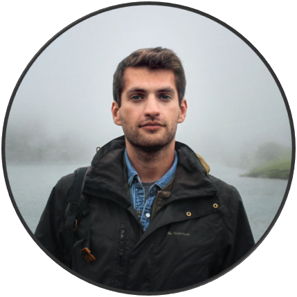

```{r load packages, include=FALSE}
library(lubridate)
```


```{r setup, include=FALSE}
knitr::opts_chunk$set(echo = FALSE)
```

```{r profile_picture, echo=FALSE, fig.height=5, fig.width=5, warning=FALSE, dev='svg', fig.align='center'}

```

### Bio

I'm Miguel, a `r floor(interval(ymd("1993-06-08"), today()) / years(1))`-year-old Mechanical Engineer with a strong passion for data analytics and visualization, process modeling and simulation. 

Having majored in Control Systems, Industrial Automation and Robotics, I developed a keen affinity for uncovering insights from data during my MSc degree (obtained from Instituto Superior Tecnico in 2017), an interest that I further explored throughout my Erasmus exchange program at RWTH Aachen (_sommersemester_ 2016), taking elective courses on applied statistics and machine learning.

I am currently based in Lisbon, working as a Data Scientist for a renowned pharmaceutical CDMO. As part of my role within the team, I am accountable for:

* Process mapping - covering people, material and information flows;
* Consolidating data from different systems, establishing new data pipelines and integration services;
* Conducting _ad hoc_ analysis, developing prototype models and proof of concept applications;
* Developing and maintaining a suite of automated reporting tools, process monitoring dashboards and forecasting models;
* Devising new process governance policies, covering roles and responsibilities for data management and best-practice operational procedures;
* Gathering requirements, leading the procurement and overseeing the implementation of innovative industrial informatics software products and hardware solutions; 

<!-- * Developing an understanding of business processes, together with project stakeholders and subject matter experts; -->

The languages I use the most are portuguese, **`R`**, **`SQL`**, english, **`pyhton`** and **`node.js`** - in that order.

Enough of work.

I travel whenever I get the chance, with a pronounced tendency to keep heading North - from hunting down coffee shops, tap rooms and restaurants in big metropolis to delving into secluded nature retreats. I enjoy swimming and indoor climbing, taking my car for a drive along the coast while listening to music and playing jams on my bass.

### This Blog 

I decided to start this blog as a way to document my learning process while practicing exploratory analysis and modelling workflows. Two types of posts will be published:

* **Longform:** presented as investigative journalism pieces, aimed at people who want to discover more about the world through data. No code will be featured on theses posts, favouring a storytelling approach weaved upon a data-driven narrative.
* **Scribbles:** shorter posts focused on promoting data literacy, where I will explore new packages and APIs while featuring code snippets that can be adapted by the readers to reproduce the analysis on their own.


Posts are written in [R Markdown](https://rmarkdown.rstudio.com/). The blog is built upon [Distill for R Markdown](https://rstudio.github.io/distill/) ( based on the web framework developed by the [Distill Machine Learning Journal](https://distill.pub/)), and deployed on [GitHub Pages](https://pages.github.com/).

The content of this blog is released under a [Creative Commons Attribution-ShareAlike 4.0 International License](https://creativecommons.org/licenses/by-sa/4.0/) and is hosted on my [GitHub account](https://github.com/CitizenDataScientist/CitizenDataScientist.github.io). 

